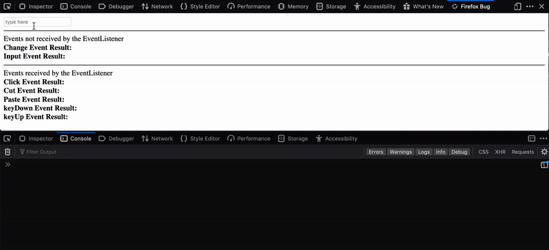

## Firefox devtools bug presentation


If "search as you type" feature is enabled on firefox, all devtool input do not receive `onchange` event at all.
This repository shows this bug in firefox. This bug has severe effect on multiple famous firefox devtool extensions too, such as:
* react-devtools, 
* redux-devtools, 
* Vue.js devtools, 
* Vue Performance Devtool

## How to use
In order to install and test this extension on your firefox browser:
1. Clone the repository on your system:

```bash
git clone https://github.com/M-Izadmehr/firefox-devtool-bug
```
2. Inside firefox address bar type: 
```
about:debugging#/runtime/this-firefox
```
3. Click `Load Temporary Add-on...`
4. Open any of the files in the `firefox-devtool-bug` repository
5. On the added add-on click inspect.
6. Now you can go to other address and start using the add-on

